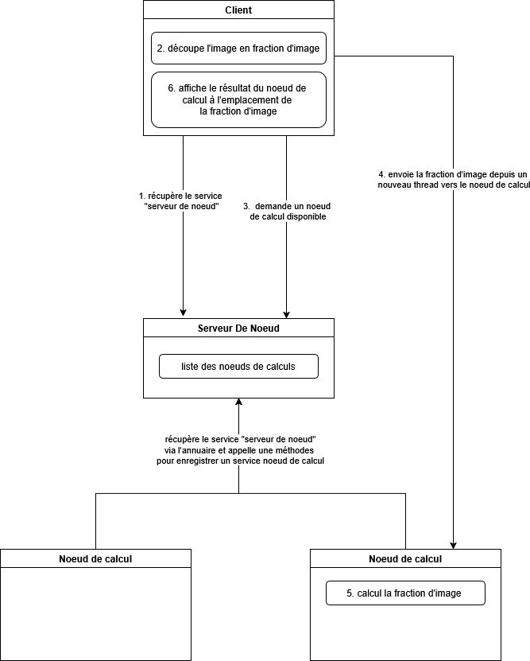
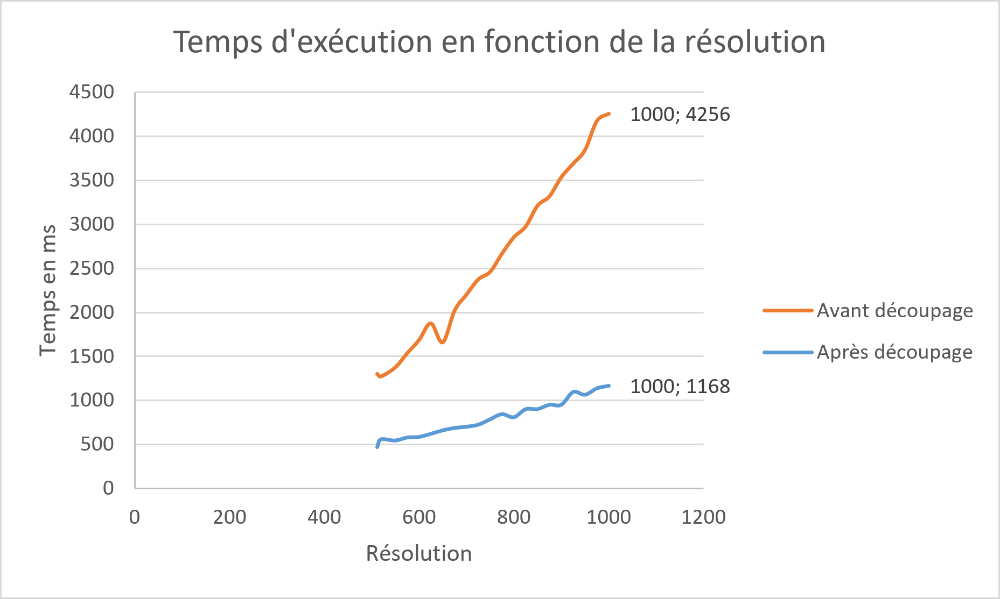
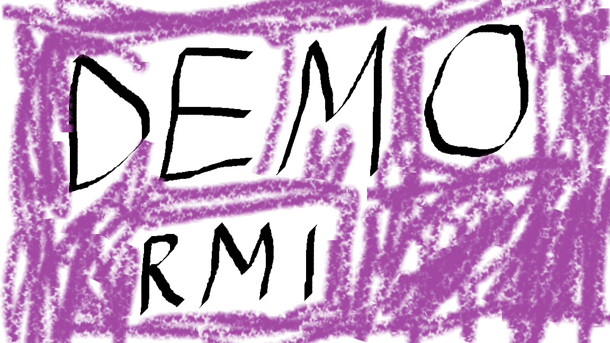

# Projet Raytracing

## Lien du repo git :
https://github.com/IanisPocachard/Projet_Raytracing/

## Membres du groupe :
- Ambroise Gilbert
- Ianis Pocachard
- Adrien Tritarelli
- Louis Ardhuin
- Tolkacheva Anastasia

## Objectif du projet
Accélérer le raytracing en divisant l’image en blocs calculés par plusieurs noeuds.

## Principe de parallélisation des données

Le calcul parallèle utilisé ici est une parallélisation des données. On applique le même traitement, `scene.compute(...)`, à plusieurs zones différentes de l'image.

Principe général :

```text
Image complète
      |
      v
Découpage en blocs
      |
      v
Envoi des blocs aux noeuds de calcul
      |
      v
Calcul des imagettes en parallèle
      |
      v
Affichage de l'image finale
```

Cette solution permet d'utiliser plusieurs machines pour un même rendu.


## Architecture

Le projet est organisé autour de plusieurs modules :

- `raytracer/` : classes fournies pour le rendu de l'image
- `calcul/` : nœuds de calcul distants
- `serveur_central/` : serveur RMI qui distribue les nœuds disponibles
- `client/` : client de rendu distribué


## Fonctionnement
- démarrage du registre : `rmiregistry`
- démarrage du serveur central : `java serveur_central/LancerServeurDeNoeud` 
- enregistrement des nœuds : `java calcul/LancerNoeudDeCalcul`
- lancement du client : `java client/LancerRayTracerDecoupe` 
- découpage de l’image
- lancement des threads 
- récupération des imagettes

## Interfaces du projet

### Interface du serveur central

```java
package serveur_central;

import java.rmi.Remote;
import java.rmi.RemoteException;
import calcul.InterfaceNoeudDeCalcul;

public interface InterfaceServeurDeNoeud extends Remote {
    public void enregistrerNoeudDeCalcul(InterfaceNoeudDeCalcul n)
        throws RemoteException;

    public void supprimerNoeudDeCalcul(InterfaceNoeudDeCalcul n)
        throws RemoteException;

    public InterfaceNoeudDeCalcul distribuerNoeudDisponible()
        throws RemoteException;
}
```

Cette interface décrit le service central. Elle permet :

- à un nœud de calcul de s'enregistrer ;
- au client de demander un nœud ;
- au client de demander la suppression d'un nœud qui ne répond plus.

### Interface d'un nœud de calcul

```java
package calcul;

import client.TacheCalcul;
import java.rmi.Remote;
import java.rmi.RemoteException;
import raytracer.Image;

public interface InterfaceNoeudDeCalcul extends Remote {
    public Image calculer(TacheCalcul calcul) throws RemoteException;
}
```

Cette interface décrit ce qu'un nœud de calcul sait faire : recevoir une tâche de calcul et retourner une image partielle.

Dans les deux cas, `Remote` sert à indiquer qu'une interface est une interface distante RMI. Cela veut dire que les méthodes de cette interface peuvent être appelées depuis une autre JVM donc potentiellement sur une autre machine.


## Processus fixes et processus mobiles

Les processus fixes sont :

- le registre RMI, qui écoute sur un port connu, généralement `1099` ;
- le serveur central, enregistré sous le nom `ServiceCentral`.

Les processus mobiles sont :

- les noeuds de calcul, qui peuvent être lancés ou arrêtés ;
- les clients, qui lancent un rendu lorsqu'ils en ont besoin.

Les noeuds de calcul ne sont pas connus directement par le client. Ils s'enregistrent auprès du serveur central, puis le client récupère leurs références grâce au serveur central.


## Types de données échangées

| Échange | Type | Rôle |
|---|---|---|
| Noeud -> serveur central | `InterfaceNoeudDeCalcul` | référence distante du noeud |
| Client -> serveur central | appel `distribuerNoeudDisponible()`, renvoie un objet de type InterfaceNoeudDeCalcul | demande d'un noeud|
| Serveur central -> client | `InterfaceNoeudDeCalcul` | référence du noeud à utiliser |
| Client -> noeud | `TacheCalcul` | bloc de l'image à calculer |
| Noeud -> client | `Image` | imagette calculée |


## Threads et calcul parallèle

Pour que les calculs se fassent réellement en parallèle, il faut lancer plusieurs appels RMI en même temps. Un appel RMI est bloquant : si le client appelle directement `noeud.calculer(...)`, il attend la fin du calcul avant de passer au bloc suivant.

Pour éviter cela, le client crée un thread par bloc :

```java
threads[numeroBloc] = new EnvoyerCalcul(x0, y0, l, h, scene, disp, noeud, serveur);
threads[numeroBloc].start();
```

La classe `EnvoyerCalcul` représente donc un thread pour le calcul d'un bloc. Elle contient la tâche à calculer, le noeud distant à appeler et l'affichage dans lequel placer l'image partielle.

Dans sa méthode `run()`, elle appelle :

```java
this.noeud.calculer(this.calcul)
```

Le noeud calcule alors l'imagette, puis le client l'affiche au directement au bon endroit avec `disp.setImage(...)`.


## Gestion des noeuds disponibles

Le serveur central possède une liste de noeuds de calcul. Lorsqu'un noeud démarre, il s'enregistre auprès du serveur central.

La méthode `distribuerNoeudDisponible()` distribue les noeuds avec un index circulaire :

```java
this.index++;
if (this.index >= this.noeuds.size()) this.index = 0;
return this.noeuds.get(this.index);
```

Dans notre projet, un noeud est considéré comme disponible s'il est présent dans cette liste. Le but est que le serveur central donne une référence de noeud, et si ce noeud ne répond plus, le client peut demander sa suppression dans la liste du serveur central.

La classe `EnvoyerCalcul` gère partiellement ce cas :

```java
catch (ConnectException e) {
    this.serveur.supprimerNoeudDeCalcul(noeud);
    this.noeud = this.serveur.distribuerNoeudDisponible();
}
```

Cela permet de retirer un noeud qui n'est plus disponible. Une amélioration possible serait de relancer automatiquement la tâche échouée sur le nouveau noeud récupéré.


## Commandes d’exécution
 
Compiler le projet :
- Se mettre à la racine du projet
- Exécuter la commande : `javac *.java calcul/*.java client/*.java raytracer/*.java serveur_central/*.java`

## Schémas

### Diagramme de l'architecture de l'application répartie




Ce schémas décrit les différentes étapes et acteurs.

Client:
   - récupère le service central en passant par l'annuaire
   - découpe l'image, pour chaque morceau d'image demande un nœud au service central, crée un thread pour utiliser ce nœud pour calculer le bout d'image
   - demande un nœud au service central
   - fait travailler le nœud de calcul pour qu'il calcule l'image

Service Central:
   - possède une liste de nœuds de calcul
   - donne au client un nœud disponible

nœud de calcul:
   - calcule l'image


Explication du fonctionnement plus finement :
1. L'annuaire RMI démarre.
2. Le serveur central crée un objet `ServeurDeNoeud`.
3. Le serveur central exporte cet objet et l'enregistre sous le nom `ServiceCentral`.
4. Chaque nœud crée un objet `NoeudDeCalcul`.
5. Chaque nœud exporte son objet.
6. Chaque nœud récupère `ServiceCentral` dans l'annuaire.
7. Chaque nœud envoie sa référence distante au serveur central.
8. Le client récupère le service central une référence distante vers le `ServeurDeNoeud`.
9. Le client découpe l'image en n * n blocs.
10. Pour chaque bloc, le client demande un nœud au serveur central.
11. Le client crée un thread `EnvoyerCalcul`.
12. Chaque thread appelle `noeud.calculer(tache)`.
13. Le nœud calcule son imagette avec `scene.compute(...)`.
14. Le nœud renvoie une `Image`.
15. Le client affiche cette image partielle au bon endroit.
16. Enfin, le client attend tous les threads qu'il a lancé avec `join()`.


### Courbes comparatives de la vitesse de chargement de l'image avec et sans répartition

Les courbes montrent que la répartition permet d'accélérer le rendu.

## Animation
[](https://raw.githubusercontent.com/IanisPocachard/Projet_Raytracing/refs/heads/main/video.webm)
